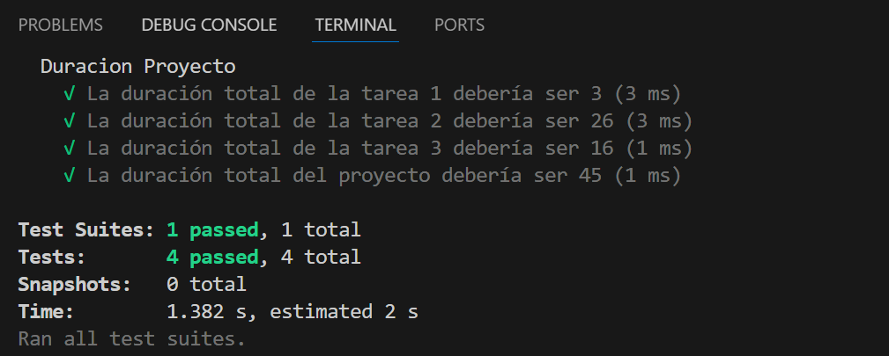
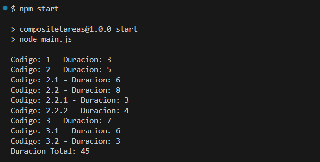

# Gestión de Proyectos

Los proyectos se componen de tareas y las tareas de subtareas, que a su vez, las subtareas pueden tener otras subtareas. Cada una de estas tareas y subtareas tiene un tiempo estimado de duración en días. La siguiente imagen ilustra la estrucutra de un proyecto.


## Requerimientos a resolver

- Determinar la duración total de una tarea simple y compuesta.
- Determinar la duración total del proyecto que incluya tareas simples y compuestas.
- Mostrar la estrcutura del proyecto, listando las tareas con su código y duración.

### Estructura para los Test

```shell
└── Proyecto
    ├── Tarea 1                 #Duración: 3
    └── Tarea 2                 #Duración: 5
        ├── Tarea 2.1           #Duración: 6
        ├── Tarea 2.2           #Duración: 8
            ├── Tarea 2.2.1     #Duración: 3
            ├── Tarea 2.2.2     #Duración: 4
    └── Tarea 3                 #Duración: 7
        ├── Tarea 3.1           #Duración: 6
        ├── Tarea 3.2           #Duración: 3
```

La duración total del proyecto es de 45 días.

## Comandos útiles

Luego de clonarse el repositorio y tenerlo descargado en su disco local, deben posicionar en la carpeta donde clonaron el proyecto

### Instalar las dependencias.

Lo primero que tiene que hacer es instalar las dependecias del proyecto con el siguiente comando

```bash
npm i
```

### Correr los test

Para correr los test del proyecto

```bash
npm test
```

Deberian tenes una salida similar a la siguiente por la consola


### Ejecutar la aplicación

Para correr correr la aplicación

```bash
npm start
```

Deberian tenes una salida similar a la siguiente por la consola

